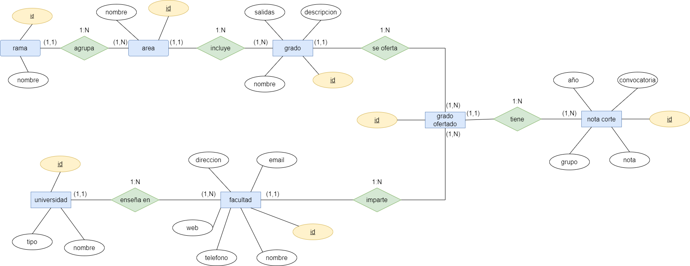
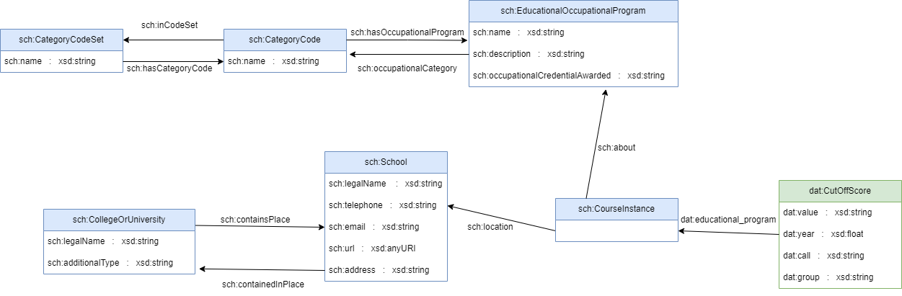

## 1. Descargar el repositorio

 ```
git clone https://github.com/Cortijo02/GESTBD.git
 ```

## 2. Levantar contenedores

```
docker compose up postgres pgadmin elasticsearch graphdb jupyter
 ```

> También se puede levantar el contenedor jupyter_llm para revisar el procesamiento de los campos *descripcion* y *salidas* con llama3.1:8b.

En la carpeta `scripts` hemos dejado una serie de `.sh` que permiten lanzar los contenedores con diferentes configuraciones.

## 3. Acceder a los servicos

 En la siguiente tabla se detallan los puertos y accesos de los servicios:

| Servicio        | Puerto local | URL de acceso                      | Descripción                                |
|-----------------|---------------|------------------------------------|--------------------------------------------|
| 🧭 **PgAdmin**  | `8082`        | [http://localhost:8082](http://localhost:8082) | Interfaz web para gestionar Postgres      |
| 🔍 **Elasticsearch** | `8000`   | [http://localhost:8000](http://localhost:8000) | Motor de búsqueda y análisis de texto     |
| 🕸️ **GraphDB**  | `8001`        | [http://localhost:8001](http://localhost:8001) | Base de datos de grafos RDF/SPARQL        |
| 📓 **Jupyter**  | `8002`        | [http://localhost:8002](http://localhost:8002) | Entorno interactivo para notebooks Python |
| 📓 **Jupyter LLMs**  | `8003`        | [http://localhost:8003](http://localhost:8003) | Entorno trabajar con jupyters, CUDA y LLMs (Ollama) |

Y a continuación las credenciales de la base de datos:

| CAMPO               | VALOR                   |
|---------------------|-------------------------|
| email               | cinco@GESTDB.com        |
| password            | cinco                   |
| name                | postgres_db             |
| host name/address   | postgres                |
| port                | 5432                    |
| username_db         | userGESTDB              |
| password_db         | passGESTDB              |
| postgres_db         | GESTDB                  |

En el contenedor de jupyter "queries.ipynb" contiene las queries a los servicios de Postgres, ElasticSearch y GraphDB.

## Sobre el trabajo

### Pasos seguidos

1. **Web scraping:** utilizamos los datos abiertos de la página de grados de la Comunidad de Madrid, que habilita PDFs con las descripciones, salidas y centros de los grados. Desde la página web base, hicimos web scraping pasa sacar las URLs de los PDFs, junto con las ramas y áreas de las webs intermedias donde estaban ordenadas. De los PDFs sacamos la información relevante (`jupyter > src > scraping > pdfs_automatizado.ipynb`) y procesamos los datos (`jupyter > src > scraping > generar_csvs.ipynb ; jupyter > src > scraping > extraccion_centros.ipynb ; jupyter > src > scraping > extraccion_notascorte.ipynb`) para obtener los CSVs.

2. **Postgres:** con los CSVs extraidos de la fase anterior definimos dos scripts `postgres > init > *.sql` para crear e insertar los datos de la carpeta `postgres > csv` durante el despliegue del servicio, siguiendo el esquema entidad relación definido a lo largo de la práctica. Una vez está desplegada la posgres nos podemos conectar a ella con las cedenciales definidas en la tabla anterior, podemos acceder a través del pgadmin o bien desde un cuaderno jupyter para lanzar consultas como veremos más adelante. El diagrama entidad relación es el siguiente:



4. **ElasticSearch:** una vez está desplegado el contenedor, generamos nuestro índice desde el propio notebook de `jupyter > src > queries > queries.ipynb`, definimos las propiedades y los tipos de las mismas siguiendo las ideas propuestas en las entregas anteriores.

5. **GraphDB:** Para realizar esto diseñamos la ontología estableciendo las tripletas (y los prefijos utilizados de ontologías existentes). A través de un script the python (`jupyter > src > graph > generador_grafo.ipynb`), pasamos de los datos de PostGres a la ontología establecida y el resultado (se genera en esa misma carpeta con nombre universidadesMadrid.ttl) lo copiamos en (`graphdb > imports`). Una vez tenemos los archivos de la carpeta `graphdb > imports` lanzamos el contenedor de GraphDB, generamos un repositorio 'Practica_GESTDB' e importamos ambos archivos (que se encuentrar en 'server files' porque los cargamos al montar el contenedor) con base iri `http://example.org/universidadesMadrid#`. Una vez se realiza esto ya podemos lanzar las queries contra este sistema. A continuación se muestra el diagrama de la ontología:



6. **Jupyter LLM:** Hemos tenido que crear nuestro propio contenedor de docker utilizando como base una imagen de `nvidia/cuda`. Tenemos un Dockerfile con sus `requirements.txt` que instala y configura el servicio de ollama para el modelo llama3.1:8b. Además también desplegamos un jupyter lab para trabajar dentro del contenedor, aquí hemos hecho la inferencia del LLM para resumir texto en base al system prompt `jupyter > src > ollama.ipynb`. Hay una pequeña exploración de los resultados obtenidos durante el preprocesado con conclusiones en `jupyter_llm > src > summary.ipynb`

> Nota: Tener CUDA y una GPU de al menos 5-6Gb para poder ejecutarlo sin problemas.

7. **Jupyter:**. Tenemos definido un Dockerfile con sus `requirements.txt` que usa de base la imagen de jupyter proporcionada en la asignatura. En este contenedor hemos trabajado la mayor parte del tiempo y es donde se pueden ver las consultas finales (`jupyter > src > queries > queries.ipynb`).

# TODO

### Futuros pasos y aspectos a mejorar

Una idea que superaba el scope de nuestro trabajo, pero que podría ser de interés consistiría en añadir una tabla con alumnos, datos personales y su carrera, e implementar un sistema de recomendación en base a gustos u otros datos para ayudar a un determinado alumno a elegir un grado universitario. Otra idea para futuros pasos consiste en escalar el proyecto a nivel nacional, en lugar de centrarse únicamente en la Comunidad de Madrid, de manera que se podrían explorar las oportunidades de forma más amplia.

Uno de los retos de este proyecto ha sido la obtención de datos desde los PDFs de la Comunidad de Madrid, que al tener múltiples formatos hacía complicado en muchos casos aplicar reglas que favoreciesen la generalización y obtuviesen toda la información bien. Por ello, un aspecto a mejorar sería mejorar el procesamiento de los datos iniciales y asegurar que estos tuviesen formatos similares en los CSVs resultantes.


### Aspectos legales

Los datos utilizados en este proyecto son utilizados con fines académicos, han sido extraídos de la página web de la Comunidad de Madrid el día 6 de noviembre de 2025.